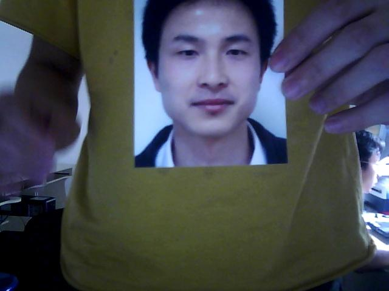

### 1. Short description

This repository contains a set of experiments for liveness detection.

Why you need an algorithm that is able to perform liveness detection? Consider that you have a face recognition system and a certain user tried to purposely circumvent your face recognition system. Such a user could try to hold up a photo of another person. Maybe they even have a photo or video on their smartphone that they could hold up to the camera responsible for performing face recognition (such as in the image at the top of this post).

In those situations it’s entirely possible for the face held up to the camera to be correctly recognized…but ultimately leading to an unauthorized user bypassing your face recognition system!

** Real person **

** Fake person **

### 2. Steps:

1) run 1_extractFaces.py  - extracts the faces from test images

2) Feature extraction:

   - run *2_computeHaralickFeatures.py'*  extracts the Haralick features. See more details on http://iab-rubric.org/papers/BTAS16-Anti-Spoofing.pdf
   
   - run *2_computeBoWFeatures.py --dictionarySize 512 --descriptorType SIFT*  extract Bag of Words features (expects two parameters: descriptor type and dictionary size)
   
   - run *2_computeHofFeatures.py*  extracts the HoG features. 
   
   - run *2_computeLBPFeatures.py'*  extracts the LBP features. 
   
3) Test features:
-  run *3_testFeatures.py*  compute the accuracy performance for each feature / classifier (Nearest Neighbors, SVM, SGD, Naive Bayes, Decision Trees, Adaboost, Gradient Boosting, Random Forest, Extremelly RandomForest)

4) Create a net from scratch
   
5) TODO: Transfer learning with MobileNet ang Resnet50

### 3. Results

TODO 
   
   
