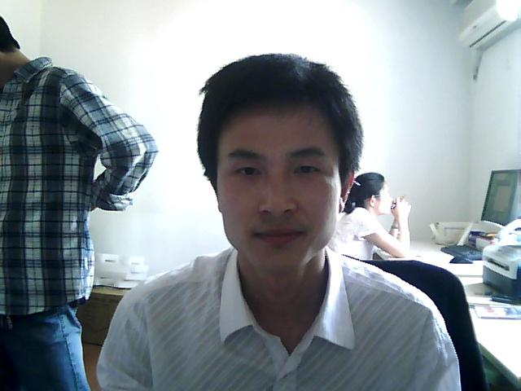

### 1. Short description

This repository contains a set of experiments for liveness detection.

Why you need an algorithm that is able to perform liveness detection? Consider that you have a face recognition system and a certain user tried to purposely circumvent your face recognition system. Such a user could try to hold up a photo of another person. Maybe they even have a photo or video on their smartphone that they could hold up to the camera responsible for performing face recognition (such as in the image at the top of this post).

In those situations it’s entirely possible for the face held up to the camera to be correctly recognized…but ultimately leading to an unauthorized user bypassing your face recognition system!

** Real person **



** Fake person **


There are a number of approaches to liveness detection, including:

- Texture analysis, including computing Local Binary Patterns (LBPs) over face regions and using an SVM to classify the faces as real or spoofed.

- Frequency analysis, such as examining the Fourier domain of the face.

- Variable focusing analysis, such as examining the variation of pixel values between two consecutive frames.

* Heuristic-based algorithms, including eye movement, lip movement, and blink detection. These set of algorithms attempt to track eye movement and blinks to ensure the user is not holding up a photo of another person (since a photo will not blink or move its lips).

- Optical Flow algorithms, namely examining the differences and properties of optical flow generated from 3D objects and 2D planes.

* 3D face shape, similar to what is used on Apple’s iPhone face recognition system, enabling the face recognition system to distinguish between real faces and printouts/photos/images of another person.

* deep learning approaches: build an adapted network for liveness detection or use a transfer learning approach

Combinations of the above, enabling a face recognition system engineer to pick and choose the liveness detections models appropriate for their particular application.

### 2. Steps:

1. run 1_extractFaces.py - extracts the faces from test images

2) Feature extraction:

   - run _2_computeHaralickFeatures.py'_ extracts the Haralick features. See more details on http://iab-rubric.org/papers/BTAS16-Anti-Spoofing.pdf

   - run _2_computeBoWFeatures.py --dictionarySize 512 --descriptorType SIFT_ extract Bag of Words features (expects two parameters: descriptor type and dictionary size)

   - run _2_computeHofFeatures.py_ extracts the HoG features.

   - run _2_computeLBPFeatures.py'_ extracts the LBP features.

3) Test features:

- run _3_testFeatures.py_ compute the accuracy performance for each feature / classifier (Nearest Neighbors, SVM, SGD, Naive Bayes, Decision Trees, Adaboost, Gradient Boosting, Random Forest, Extremelly RandomForest)

4. Create a net from scratch:
   Structure images dataset folder as follow:

   ```
    /4_liveness net
    ├─┬ /dataset
    │ ├── /real
    │ ├── /fake
    ├─┬ /test_net   _contains images to run trained model_
    ├─┬ /augment _contains images to augment_
   ```

- run _extract_faces.py_ - Detect faces from each image from dataset and save to face_dataset folder
- run _train_livenessNet.py_ - Train network with face images set extracted before and classify to real and spoofed(fake)
- run _test_livenessNet.py_ - Test and use trained model

  **Note**: run _augment_img.py_ if augmented data needed. [Augmentor](https://augmentor.readthedocs.io/en/master/code.html) library is used

5. Transfer learning with MobileNet ang Resnet50: TODO

### 3. Results

TODO
